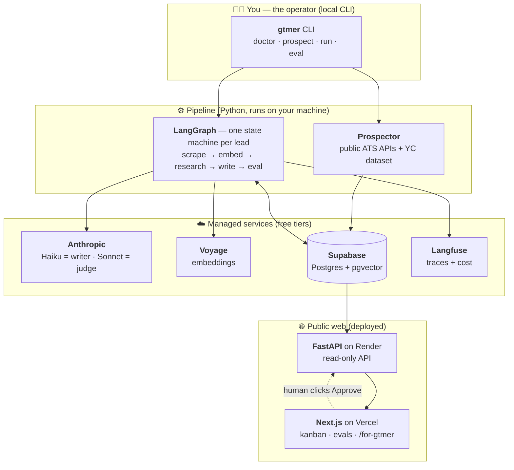
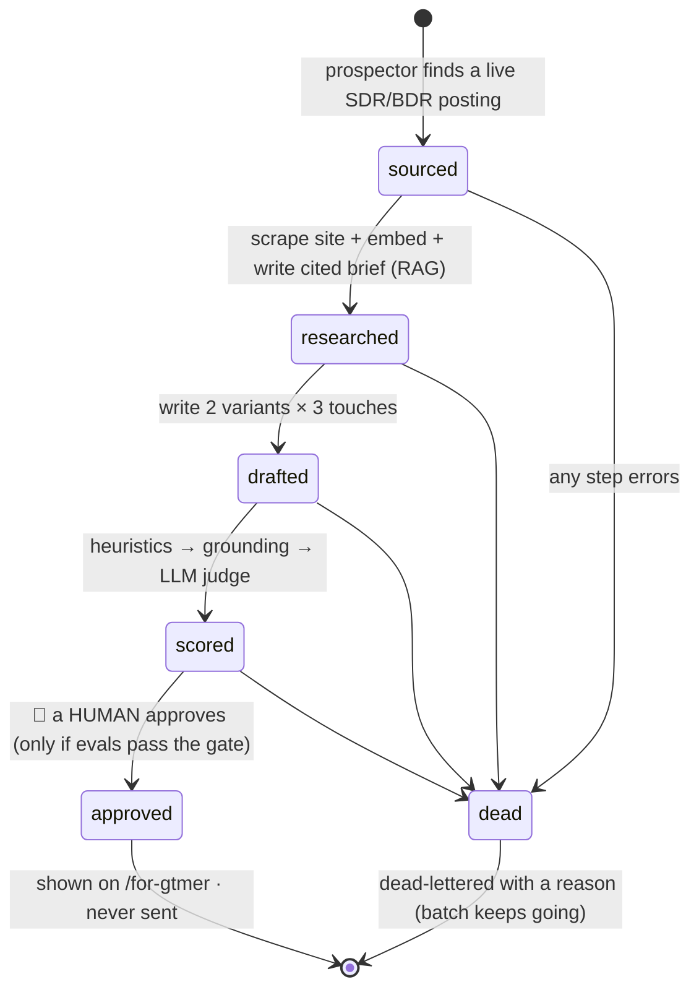
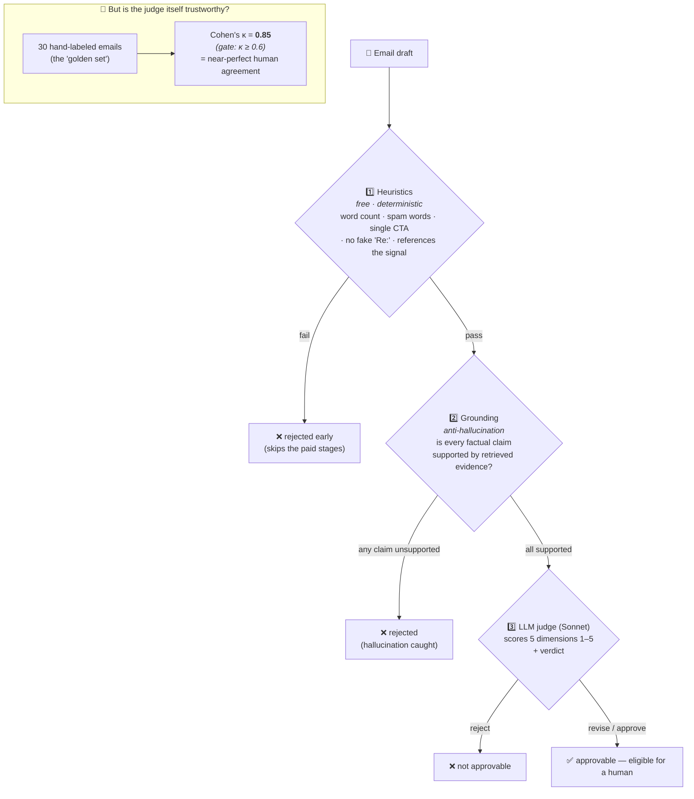
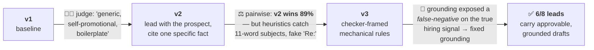
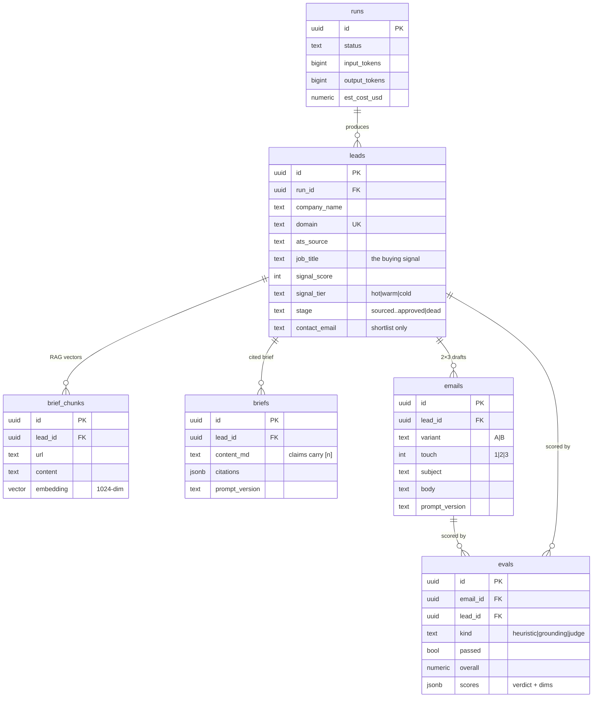
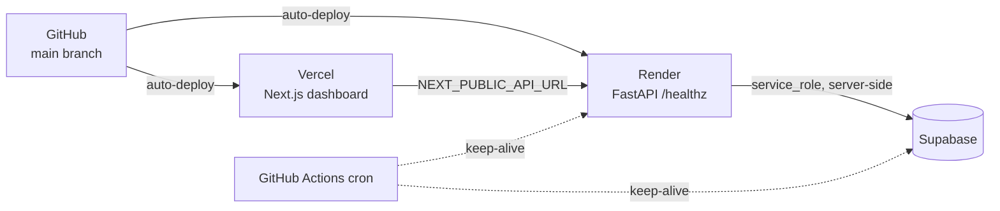

# PipelineAgent — "10 Meetings for GTMer"

**An autonomous AI-SDR pipeline that finds companies worth selling to, researches them, writes personalized outreach, and — most importantly — *grades its own work* with a rigorous eval harness. Run live on [GTMer](https://gtmer.ai)'s own ideal customer.**

> 🔗 **Live demo:** [pipeline-gtmer.vercel.app](https://pipeline-gtmer.vercel.app) · **Code:** [github.com/100-mitra/pipeline-gtmer](https://github.com/100-mitra/pipeline-gtmer) · **API:** [/healthz](https://gtmer-pipeline-api.onrender.com/healthz)

> 🛑 **Hard rule: nothing is ever sent.** The pipeline stops at `approved`, and a *human* clicks the final button. Cold-emailing a founder who does outbound for a living, you don't risk a deliverability mistake — so sending is designed to be impossible.

---

## Table of contents
1. [What is this? (for everyone)](#1-what-is-this-for-everyone)
2. [Why it's built this way — the "anti-11x" thesis](#2-why-its-built-this-way--the-anti-11x-thesis)
3. [The big picture (architecture diagram)](#3-the-big-picture)
4. [How one lead flows through it (lifecycle diagram)](#4-how-one-lead-flows-through-it)
5. [Under the hood — the pipeline (sequence diagram)](#5-under-the-hood--the-pipeline)
6. [The eval harness — the heart of the project](#6-the-eval-harness--the-heart-of-the-project)
7. [How the evals made the writing better (the v1→v2→v3 loop)](#7-how-the-evals-made-the-writing-better)
8. [Lead sourcing — what's ToS-safe, and what I learned](#8-lead-sourcing)
9. [Data model (ER diagram)](#9-data-model)
10. [Tech stack](#10-tech-stack)
11. [Results](#11-results)
12. [Project structure](#12-project-structure)
13. [Run it locally](#13-run-it-locally)
14. [Deployment](#14-deployment)
15. [Design decisions (the judgment calls)](#15-design-decisions)
16. [What I'd build next at GTMer](#16-what-id-build-next-at-gtmer)
17. [Honest limitations](#17-honest-limitations)

---

## 1. What is this? (for everyone)

Imagine you run a software company and you want more sales meetings. The old way: hire a junior salesperson (an "SDR" — Sales Development Representative) whose whole job is to find promising companies, research each one, and send them a thoughtful, personalized email asking for a meeting. It works, but it's slow and it takes months to train someone to do it well.

**This project is a software robot that does that whole job** — and it's run on a real company, **GTMer**, that sells exactly this kind of robot. So the project is both a *demonstration* ("here's a working version of your product") and a *gift* ("here are 8 real companies you could sell to, already researched and written up").

It does five things, in order:

| Step | Plain English | The fancy word |
|------|---------------|----------------|
| 1. **Find** | Look for companies that are *hiring salespeople right now* — a strong sign they're investing in sales and would buy a tool that helps. | Prospecting |
| 2. **Research** | Read each company's website and write a short, fact-checked brief: what they sell, to whom, what's changing for them. | RAG (retrieval-augmented generation) |
| 3. **Write** | Draft a personalized 3-email sequence to each company, referencing specific facts. | Generation |
| 4. **Grade** | Score every draft for quality — is it personalized? does it make things up? is it spammy? — and *throw out the bad ones*. | Evaluation ("evals") |
| 5. **Approve** | A human reviews the survivors and approves the best. Only then do they appear in the final list. | Human-in-the-loop |

> 💡 **The one idea to remember:** anyone can make an AI write emails. The hard part — and the entire point of this project — is **proving the emails are actually good**, automatically, at scale. That's step 4, and it's where 90% of the engineering went.

---

## 2. Why it's built this way — the "anti-11x" thesis

The AI-SDR industry's cautionary tale is a company called **11x.ai**. In 2025, an investigation surfaced fake customer logos, revenue counted on contracts customers were cancelling, and 70–80% churn; the CEO stepped down. The lesson the whole category absorbed: **the failure mode isn't the AI writing — it's nobody measuring whether the output is any good.**

Meanwhile, the money flowed to the companies built around *human-checked* quality — Clay (~$3.1B) and Unify ($40M) — whose workflow is exactly **find → research → draft → human review.**

So this project's centerpiece is deliberately **not** the AI agents. It's the **eval harness**: every draft is gated by deterministic checks, a hallucination/grounding check against retrieved evidence, and an LLM judge that is *itself validated against a hand-labeled answer key* (Cohen's κ = 0.85). **That's the credibility layer 11x skipped** — and it's the thing a technical founder actually wants to see.

---

## 3. The big picture

Three planes: **you** drive the pipeline from a command line; the **pipeline** does the work using managed AI/data services; a thin **public web app** lets anyone (including the founder) watch and review the results.



**Why split read/write like this?** The pipeline (which spends money on AI calls) runs locally under a hard budget cap. The deployed web app is **read-only** — it just shows what's in the database — plus one safe mutation (advancing a lead's stage). A stranger with the URL can never trigger an AI call or send an email.

---

## 4. How one lead flows through it

Every company is a **lead** that moves through six stages. Think of it as a kanban board (which is literally what the dashboard shows): a card moves left-to-right as the pipeline does more work on it, and only a human can move it into the final `approved` column.



> 💡 **In plain English:** a card can only move forward if the work succeeded. If anything breaks (a website won't load, the AI returns garbage), the lead is set aside as `dead` *with a reason* and the system moves on — one bad lead never crashes the whole batch. And the jump to `approved` is the only step a robot can't take: a person has to click it, and even then only if the drafts passed every quality check.

---

## 5. Under the hood — the pipeline

The work for a single lead is a **LangGraph state machine** — a small, deterministic flowchart of steps where each step's output feeds the next, and any error short-circuits to a "dead-letter" handler. Here's exactly what happens, and which external service each step calls:

```mermaid
sequenceDiagram
    actor Op as Operator (gtmer run)
    participant G as LangGraph
    participant Web as Prospect's website
    participant V as Voyage (embeddings)
    participant DB as Supabase (pgvector)
    participant H as Haiku (cheap writer)
    participant S as Sonnet (smart judge)

    Op->>G: invoke(lead)
    G->>Web: scrape home / about / pricing (httpx → Firecrawl fallback)
    G->>V: embed the page chunks
    G->>DB: store vectors
    Note over G,DB: RAG — retrieve the most relevant chunks, don't dump the whole site
    G->>DB: match_chunks (vector search)
    G->>H: write a cited research brief from ONLY those chunks
    G->>H: write 2 variants × 3 emails, grounded in the brief
    G->>DB: save brief + 6 drafts

    rect rgb(20, 40, 60)
    Note over G,S: Eval cascade — cheap checks first, expensive last
    G->>G: 1️⃣ heuristics (free, deterministic)
    G->>V: embed each factual claim
    G->>DB: match_chunks per claim
    G->>H: 2️⃣ grounding — is each claim supported?
    G->>S: 3️⃣ judge — score 1–5 on 5 dimensions + verdict
    end
    G->>DB: save evals · set stage = scored
```



Key engineering properties baked into this loop:

- **Budget guard before every AI call.** A running cost meter checks the spend *before* each request and aborts cleanly at a per-run cap and a `$20` lifetime hard cap — a retry storm can't run up a bill.
- **Idempotent & resumable.** Scraped pages are cached by URL; briefs/emails/evals are keyed by `(lead, prompt_version)`. Re-running a finished lead costs ~nothing.
- **Structured outputs everywhere.** Every AI step returns a validated Pydantic object via `messages.parse(...)`; malformed output is caught and dead-lettered, never silently stored.
- **Writer ≠ Judge.** A cheap model (Haiku) writes; a stronger, *different* model (Sonnet) judges — so the judge isn't grading its own homework (that inflates scores via self-preference bias).

---

## 6. The eval harness — the heart of the project

This is the part most candidates skip, and the reason this project exists. Every draft runs a **three-stage cascade, cheapest first** — a failure at any stage stops the lead from wasting money on the next one.



The three stages, and why each exists:

1. **Heuristics** (pure Python, instant, free). Catches the mechanical failures: subject too long, spam words, more than one call-to-action, fake `Re:` reply-subjects, or a touch-1 email that doesn't even mention the hiring signal. Cheap gate, run first.
2. **Grounding** (the anti-hallucination layer). The AI extracts every factual claim the email makes about the prospect, retrieves supporting evidence for each, and checks entailment. **If *any* claim isn't supported, the whole email fails.** This is the literal "anti-11x" mechanism — it catches the AI inventing facts.
3. **LLM-as-judge** (Sonnet). Scores personalization, relevance-to-signal, clarity, CTA quality, and spam-risk (1–5 each) and returns a verdict.

> 💡 **The clever part:** an LLM judge is only useful if it agrees with a human. So I hand-labeled **30 emails** (good, spammy, and hallucinated) and measured **Cohen's κ = 0.85** between the judge and my labels — "almost perfect" agreement. The pipeline *refuses to trust* batch judge scores unless κ ≥ 0.6. Prompt-version decisions use **randomized pairwise comparison** (not absolute scores, which drift), with A/B order shuffled to neutralize the judge's position bias.

---

## 7. How the evals made the writing better

The evals aren't just a filter — they **drove three measurable iterations** of the writer prompt. Crucially, three *independent* eval signals each caught a different class of problem, which is the whole point: no single metric is trusted alone.



| Version | What changed | The eval signal that caught the problem |
|---|---|---|
| **v1** | baseline | **LLM judge** flagged it as generic / self-promotional → avg ~2.5/5, mostly *reject* |
| **v2** | lead with the prospect; cite a specific fact | **Pairwise comparison**: v2 beat v1 in **8 of 9** head-to-heads (89%) — but the **deterministic heuristics** then caught a regression (long subjects, fake `Re:` bumps, double CTAs) |
| **v3** | checker-framed mechanical rules | Heuristic pass jumped **0/6 → 16/18**; then **grounding** revealed it was falsely failing the *true* hiring signal (absent from the website-scraped brief) → fixed grounding to treat the verified ATS job posting as a source |

That last fix is the most telling: the eval system caught a flaw *in itself* (a false-negative), not just in the writer. That's a self-correcting quality loop — exactly what gives a founder confidence the numbers are real.

---

## 8. Lead sourcing

A company **hiring an SDR/BDR is investing in outbound** — the exact buying signal for an AI-SDR tool — and job postings are public data. Sourcing uses **public ATS (applicant tracking system) JSON APIs**, which are no-auth and vendor-sanctioned:

| Source | Endpoint | Status |
|---|---|---|
| Greenhouse | `boards-api.greenhouse.io/v1/boards/{token}/jobs` | ✅ public, no auth |
| Lever | `api.lever.co/v0/postings/{token}?mode=json` | ✅ public, no auth |
| Ashby | `api.ashbyhq.com/posting-api/job-board/{token}` | ✅ public, no auth |

**Two findings that only surfaced by running it for real:**

- **Parsing careers-page HTML for the board token fails** — most careers pages are JavaScript-rendered, so the token isn't in the raw HTML. Fix: probe the ATS APIs *directly* with a **guessed token** (the slug is almost always the company name). This recovered Postman's Greenhouse board (7 SDR/BDR roles) and Atlan's Ashby board — both invisible to HTML scraping.
- **~90% of Indian B2B SaaS don't use Greenhouse/Lever/Ashby** (they're on Workday/Darwinbox/Keka). The YC dataset has only **138 Indian** B2B SaaS vs **3,843 global**, so the universe **interleaves** India + global probing (both get sampled within the limit) with an **India scoring boost** so Indian leads still headline. GTMer sells globally, so a global company hiring SDRs is a valid prospect — and the 3 Indian leads still rank 1/3/4.

**Deliberately excluded** (documented because *judgment* is the point): Wellfound (DataDome 403s all automated access), Naukri (edge-blocks non-browser traffic), Cutshort (ToS bans automated collection), Google SERP scraping (ToS), and the Google Custom Search API (closed to new customers). LinkedIn contacts are added **manually** for the final shortlist only.

---

## 9. Data model

Everything the pipeline produces lives in Supabase (Postgres + the `pgvector` extension for vector search). One run produces many leads; each lead accumulates research chunks, a brief, drafts, and evals.



All access is over HTTPS (Supabase REST + an RPC for vector search) — there's no direct Postgres connection, which sidesteps an IPv6-only-host issue on Windows and keeps the deploy credential-light.

---

## 10. Tech stack

| Concern | Choice | Why |
|---|---|---|
| Orchestration | **LangGraph 1.2** (Graph API) | deterministic per-lead state machine with clean error routing |
| LLM — writer | **Claude Haiku 4.5** ($1/$5 per MTok) | cheap, fast, good enough to draft |
| LLM — judge | **Claude Sonnet 4.6** ($3/$15) | stronger + *different tier* → no self-preference bias |
| Embeddings | **Voyage `voyage-4-lite`** | 200M free tokens ≈ $0 for this project |
| Database / RAG | **Supabase** (Postgres + pgvector) | free tier; vector search via RPC over HTTPS |
| Observability | **Langfuse** Cloud | per-call traces + token cost |
| Backend | **FastAPI** on Render (free) | read-only API + one guarded mutation |
| Frontend | **Next.js 14** on Vercel (Hobby) | thin kanban + evals + the pitch page |
| Validation | **Pydantic v2** | structured outputs, fail-loud |
| Scraping | **httpx + BeautifulSoup**, Firecrawl fallback | handles static + JS-rendered sites |
| Contacts | **Hunter.io** free tier | domain-search for the shortlist, last mile |

---

## 11. Results

Real numbers from running it on GTMer's ICP (every figure is reproducible via the CLI):

- **12 qualified leads** sourced (3 Indian headlining: **Postman** 🔥, **Atlan**, **Scribe**).
- **κ = 0.85** judge–human agreement on the 30-email golden set (90% exact-verdict agreement).
- **v2 wins 89%** of blind pairwise comparisons vs v1 (promotion bar is 65%).
- The final deliverable is **6 hand-curated leads** (3 India-headlining), **every one a company genuinely hiring a front-line SDR/BDR/ADR**, each with grounded, eval-scored drafts — the eval gate *and* a curation pass filter the rest.
- **24 tests** passing (ATS parsers, the guessed-token resolver, qualify regex + India boost, heuristics).
- Total spend across *everything* (source → score → 4 prompt iterations → enrichment): **~$2** of a $20 cap.

---

## 12. Project structure

```
pipeline/
├── cli.py                 # gtmer CLI: doctor · prospect · run · eval · enrich-top10 · report
├── config.py              # pydantic-settings (keys, models, budgets); forces UTF-8 on Windows
├── models.py              # domain Pydantic models (Brief, EmailSequence, JudgeScore, …)
├── db.py                  # Supabase access — all over HTTPS (REST + match_chunks RPC)
├── llm.py                 # Anthropic wrappers: messages.parse + Batch API + budget hook
├── budget.py              # BudgetGuard — checks spend BEFORE every call
├── cache.py               # on-disk scrape cache (idempotent re-runs)
├── trace.py               # Langfuse tracing (optional, never blocks a run)
├── runner.py              # orchestration: prospect, then drive the per-lead graph
├── prospector/            # universe.py · ats.py (guessed-token probing) · qualify.py
├── researcher/            # scraper.py · chunker.py · embeddings.py · brief.py (RAG)
├── writer/sequence.py     # 2×3 sequence + shape normalization
├── evals/                 # heuristics · grounding · judge · golden (κ) · pairwise · batch_runner
├── prompts/{v1,v2,v3}/    # versioned prompts (sha256-tracked); the v1→v2→v3 story
├── graph/                 # state.py · build.py · nodes/{scrape,embed,research,write,evaluate,deadletter}
└── api/                   # FastAPI: main.py (CORS) · routes.py · schemas.py
supabase/migrations/0001_init.sql   # schema + pgvector + match_chunks function
dashboard/                          # Next.js: kanban · /leads/[id] · /evals · /for-gtmer/[slug]
data/                               # companies_in.csv (seed) · golden/golden_set.jsonl (labels)
tests/                              # offline tests (no API keys needed)
```

---

## 13. Run it locally

Prereqs: Python 3.12, Node 18+ (for the dashboard), a free Supabase project, and Anthropic + Voyage keys.

```powershell
cd C:\dev\gtmer-pipeline
py -3.12 -m venv .venv ; .\.venv\Scripts\Activate.ps1
pip install -e ".[dev]"
copy .env.example .env            # fill in keys; generate FOR_GTMER_SLUG
$env:PYTHONUTF8 = "1"
# apply supabase/migrations/0001_init.sql in the Supabase SQL editor

python -m pipeline.cli doctor                       # all 4 integrations green (asserts embed dim == 1024)
python -m pipeline.cli prospect --limit 250         # universe → ATS probe → qualify → sourced leads
python -m pipeline.cli run --limit 50 --version v3  # drive the graph to 'scored'
python -m pipeline.cli eval golden                  # judge–human κ (gate ≥ 0.6)
python -m pipeline.cli eval pairwise --a v1 --b v3  # promote a writer prompt on evidence
python -m pipeline.cli enrich-top10                 # Hunter contacts for the shortlist
python -m pipeline.cli report                       # funnel + lifetime spend

uvicorn pipeline.api.main:app --port 8000           # the read API
cd dashboard ; npm install ; npm run dev            # the dashboard on :3000
```

Tests (no keys needed): `pytest -q` → **24 passing**.

---

## 14. Deployment

- **Backend → Render** (free Docker web service). Auto-builds from `render.yaml`; set `SUPABASE_URL`, `SUPABASE_SERVICE_ROLE_KEY`, `FOR_GTMER_SLUG`. Health check at `/healthz`.
- **Frontend → Vercel** (Hobby). Root directory = `dashboard`; set `NEXT_PUBLIC_API_URL` to the Render URL. `dashboard/vercel.json` pins the framework so detection can't drift.
- **Keep-alive** — a GitHub Actions cron pings Supabase (beats the 1-week pause) and Render (beats the 15-min spin-down) so the demo stays warm.



---

## 15. Design decisions

These are deliberate, and each signals judgment:

- **Never send.** The pipeline ends at `approved`. Showing restraint here reads as senior, not incomplete.
- **Thin UI on purpose.** No auth, no drag-and-drop, no settings. The agents and evals are the product; a founder judges the pipeline, not the CSS.
- **Privacy by surface.** Scraped contact emails are **masked** on the public dashboard (`k****@company.com`); full contact data is served only by the private, slug-gated `/for-gtmer` page. Sloppy handling of scraped personal data is the last thing to show a founder in this space.
- **Writer ≠ Judge, and the judge is validated.** A measured κ beats any prose claim of quality.
- **Budget is enforced, not hoped for.** A local meter gates every call; Langfuse is for observability, not enforcement.

---

## 16. What I'd build next at GTMer

- **Voice qualification** (Vapi): an agent that calls a prospect, asks 3 qualifying questions, and returns a structured lead score — closing the email/LinkedIn/**call** triad.
- **Send-layer integration** (Smartlead/Instantly) *behind* the approve gate, with warmup + deliverability handled — so `approved → sent` becomes a guarded one-line swap.
- **Reply-driven learning loop:** feed reply outcomes back as labels and let pairwise drive *automatic* prompt promotion — the evals become a flywheel, not a snapshot.
- **More ATS adapters** (Workday/Darwinbox) to deepen India coverage, where the supported ATSes are sparse.

---

## 17. Honest limitations

| Limitation | Reality / mitigation |
|---|---|
| Email quality is "good, not perfect" | Haiku is a cheap writer by design; the *system* (eval rigor + measured improvement) is the deliverable, not flawless prose |
| Sparse Indian ATS coverage | ~90% of Indian SaaS use unsupported ATSes → broadened to global with an India ranking boost |
| Grounding is strict | one unsupported claim fails an email — intentional (zero-hallucination), occasionally over-eager |
| Judge ≠ ground truth | validated to κ = 0.85, not 1.0; a human still approves every lead |
| Contact data can be stale | Hunter scores included; shortlist contacts verified manually |

---

*Built as a working answer to GTMer's own screening question — "How would you get GTMer its next 10 sales meetings?" — and run on their own ideal customer. The pipeline finds the leads; the eval harness proves they're worth sending. Nothing was sent.*
